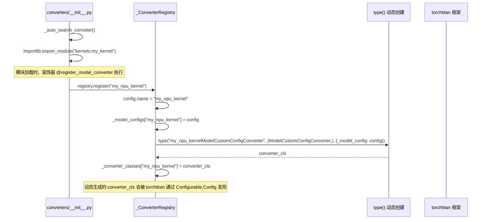
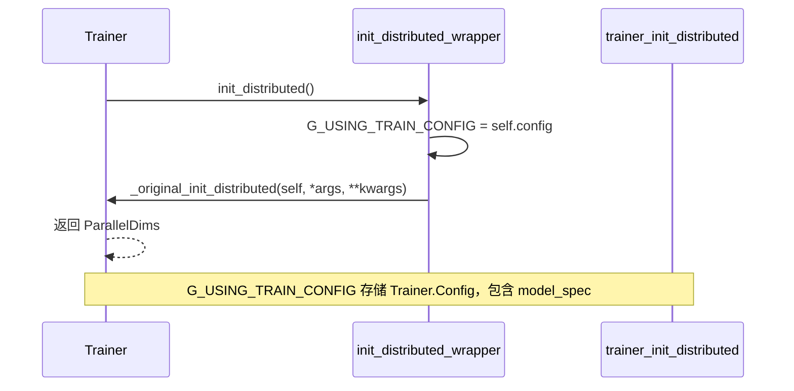
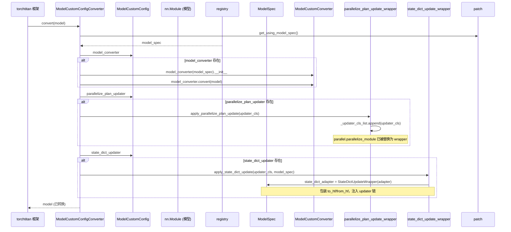
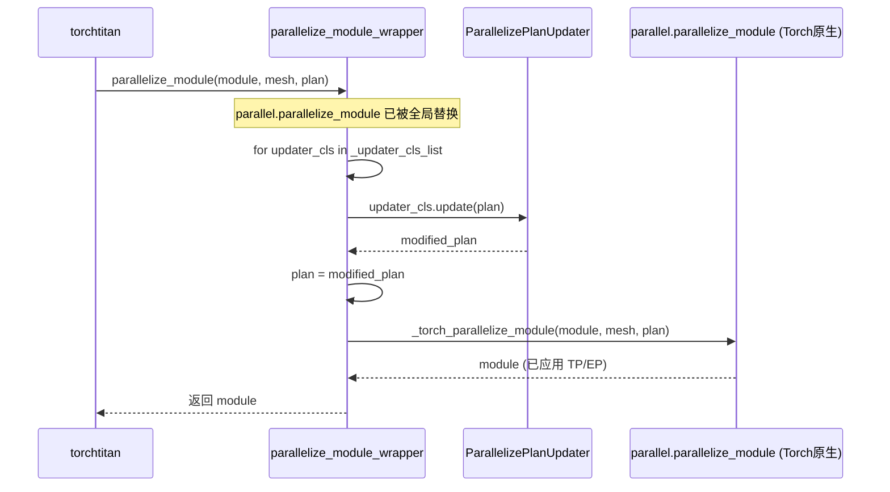
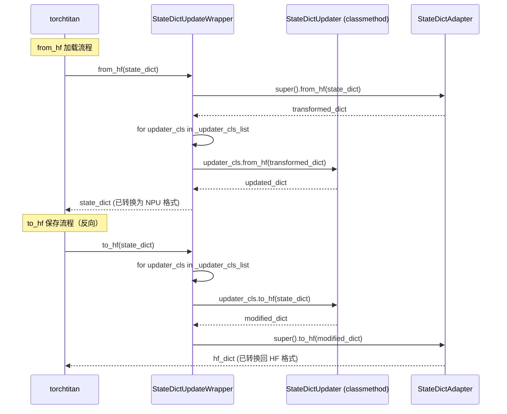

# Model Custom框架介绍

## 1. 重构目的

**基于TorchTitan的ModelConverter机制，为TorchTitan_npu提供了一套声明式、可组合的模型自定义框架，取代了原先monkey-patch方式**

## 2. 使用方法

### 2.1 模型定制化入口

```python
@dataclass
class ModelCustomConfig:
    """Model customization configuration"""

    name: str = "default"
    model_converter: type["ModelCustomConverter"] | None = None
    parallelize_plan_updater: type["ParallelizePlanUpdater"] | None = None
    state_dict_updater: type["StateDictUpdater"] | None = None
```

### 2.2 以GMM为例演示定制化流程

#### 2.2.1 第一步：定义替换成子类实例的Converter

继承上游类（`GroupedExperts`），在构造函数中接收原始实例并做转换：

```python
# ──────────────────────────────────────────────────
# 1. 定义子类 + 定义执行替换Converter
# ──────────────────────────────────────────────────
# torchtitan_npu/converters/kernels/gmm.py

from torchtitan.models.common.moe import GroupedExperts

class NpuGroupedExperts(GroupedExperts):
    """替换原版 GroupedExperts，将 w1+w3 合并为 w13 以适配 NPU grouped_matmul 算子"""

    def __init__(
        self,
        parent: GroupedExperts,
    ):
        # Shallow copy of parent's __dict__ is intentional here:
        # - GroupedExperts attributes are primarily PyTorch modules and buffers (weights should be shared)
        # - Avoids complex dependency on GroupedExperts.__init__ parameters (dim, hidden_dim, num_experts)
        # - Parent instance already has all attributes properly initialized
        # Note: If GroupedExperts had mutable non-module attributes requiring independent state,
        # we would need explicit attribute copying instead
        self.__dict__.update(parent.__dict__)
        self.use_grouped_mm = True
        if self.w1 is not None and self.w3 is not None:
            # pyrefly: ignore [no-matching-overload]
            w13_data = torch.empty(
                self.num_experts,
                self.w2.shape[2] * 2,
                self.w2.shape[1],
                dtype=self.w1.dtype,
                device=self.w1.device,
            )
            self.w13 = nn.Parameter(w13_data)

            # pyrefly: ignore [bad-assignment]
            self.w1 = None
            # pyrefly: ignore [bad-assignment]
            self.w3 = None

            logger.info(f"  NpuGroupedExperts: Created w13 [{w13_data.shape}]")

    def forward(self, x, num_tokens_per_expert):
        # Convert parameters from DTensors to plain Tensors, to work with
        # dynamic-shape inputs in EP which cannot be easily expressed as DTensors.
        is_dtensor = isinstance(self.w2, DTensor)
        # pyrefly: ignore [missing-attribute]
        w2 = self.w2.to_local() if is_dtensor else self.w2
        # pyrefly: ignore [missing-attribute]
        w13 = self.w13.to_local() if is_dtensor and self.w13 is not None else self.w13
        ...

    def init_weights(self, init_std: float):
        for w in [self.w2, self.w13]:
            if w is not None:
                nn.init.normal_(w, mean=0.0, std=init_std)


# 定义执行替换的Converter
from torchtitan_npu.converters.convert_utils import replace_module_with_name
from torchtitan_npu.converters.model_custom_interface import ModelCustomConverter

class NpuGroupedExpertConverter(ModelCustomConverter):
    def convert(self, model: nn.Module):
        for name, module in model.named_modules():
            if not isinstance(module, GroupedExperts):
                continue
            replace_module_with_name(model, name, NpuGroupedExperts(module))
```

**要点：**
- 使用 `self.__dict__.update(parent.__dict__)` 浅拷贝父实例的所有属性，避免复杂的 `__init__` 参数依赖
- 这种方式适用于父类属性主要是 PyTorch 模块和缓冲区（权重应共享），且父实例已正确初始化
- 覆写定制化的业务逻辑的方法，比如 `forward`、`init_weights` 等
- 构造一个继承自 ModelCustomConverter 的自定义 Converter，用于执行替换实例的动作

#### 2.2.2 第二步：定义 ParallelizePlanUpdater（可选）

如果需要更新并行策略：

```python
layer_plan = {
            "attention_norm": SequenceParallel(
                use_local_output=False,
            ),
            # NOTE: when the fourth argument (positions) is not None, its input layout
            # and desired input layout should be Replicate()
            "attention": PrepareModuleInput(
                input_layouts=(Shard(1), Replicate(), None, Replicate()),
                desired_input_layouts=(Replicate(), Replicate(), None, Replicate()),
            ),
            "attention.wq": ColwiseParallel(use_local_output=False),
            "attention.wk": ColwiseParallel(use_local_output=False),
            "attention.wv": ColwiseParallel(use_local_output=False),
            "attention.q_norm": SequenceParallel(
                sequence_dim=2,
                use_local_output=False,
            ),
            "attention.k_norm": SequenceParallel(
                sequence_dim=2,
                use_local_output=False,
            ),
            # Apply on vllm.Attention() module to use local tensor
            "attention.inner_attention": PrepareModuleInputOutput(
                input_layouts=(Shard(1), Shard(1), Shard(1)),  # xq, xk, xv
                desired_input_layouts=(None, None, None),
                use_local_input=True,  # use local tensor for attention calculation
                output_layouts=(Shard(1)),  # output
                desired_output_layouts=(Shard(1)),
                use_local_output=False,
            ),
            "attention.wo": RowwiseParallel(
                output_layouts=Shard(1),
                use_local_output=False,
            ),
            "ffn_norm": SequenceParallel(
                use_local_output=False,
            ),
        }
```

```python
# ──────────────────────────────────────────────────
# 2. 并行计划修改器（可选）
# ──────────────────────────────────────────────────
from torchtitan_npu.converters.parallelize_plan_updater import ParallelizePlanUpdater

class GMMParallelizePlanUpdater(ParallelizePlanUpdater):
    @classmethod
    def update(
        cls, parallelize_plan: ParallelStyle | dict[str, ParallelStyle] | None
    ) -> ParallelStyle | dict[str, ParallelStyle] | None:
        """Update the layer plan"""
        if type(parallelize_plan) is ExpertParallel:
            return GMMExpertParallel()
        return parallelize_plan
```

#### 2.2.3 第三步：定义 StateDictUpdater（可选）

如果权重格式需要适配（如 checkpoint 加载/保存时 `w1+w3` 和 `w13` 的格式差异）：

```python
# ──────────────────────────────────────────────────
# 3. 权重格式转换器（可选）
# ──────────────────────────────────────────────────
from torchtitan_npu.converters.state_dict_updater import StateDictUpdater

class GMMStateDictUpdater(StateDictUpdater):
    @classmethod
    def to_hf(cls, state_dict):
        has_w13 = any(".moe.experts.w13" in k for k in state_dict.keys())
        if has_w13:
            state_dict = _split_w13_for_mapping(state_dict)
        return state_dict

    @classmethod
    def from_hf(cls, state_dict):
        filtered = {
            k: v for k, v in state_dict.items() if not k.endswith(".weight_scale_inv")
        }

        return fuse_experts(filtered)
```

#### 2.2.4 第四步：声明配置并注册

使用 `@register_model_converter` 装饰器，一行完成声明 + 注册：

```python
# ──────────────────────────────────────────────────
# 4. 声明配置 + 注册
# ──────────────────────────────────────────────────
from torchtitan_npu.converters import ModelCustomConfig, register_model_converter

@register_model_converter("npu_gmm")                         # <-- 装饰器完成注册
class GMMModelConfig(ModelCustomConfig):                     # <-- 声明配置
    model_converter = NpuGroupedExpertConverter              # 替换module的converter
    parallelize_plan_updater = GMMParallelizePlanUpdater     # 并行计划修改器（可选）
    state_dict_updater = GMMStateDictUpdater                 # 权重转换器（可选）
```

#### 2.2.5 第五步：激活配置

```python
# ──────────────────────────────────────────────────
# 5. 激活配置
# ──────────────────────────────────────────────────
# 在对应的toml文件中配置
[model]
converters = ["npu_gmm"]
```

## 3. 架构概览

### 3.1 核心组件

| 组件 | 文件 | 职责 |
|------|------|------|
| `register_model_converter()` | `converters/registry.py` | **注册装饰器**，将自定义配置注册到全局单例 `_ConverterRegistry`，并通过ModelConverter应用到模型 |
| `ModelCustomConfig` | `converters/model_custom_interface.py` | **声明模型自定义配置**，描述自定义所需的补丁 |
| `ModelCustomConfigConverter` | `converters/framework/model_custom_config_converter.py` | **配合自定义模型配置的ModelConverter**，继承 Configurable 和 ModelConverter，读取配置并应用到模型 |
| `ModelCustomConverter` | `converters/model_custom_interface.py` | **执行Module替换的抽象基类**，开发者自定义子类，用于满足较为复杂的替换场景 |
| `ParallelizePlanUpdater` (ABC) | `converters/model_custom_interface.py` | **并行策略修改接口**，在 `parallelize_module` 前拦截并修改 TP/EP 策略（classmethod） |
| `StateDictUpdater` (ABC) | `converters/model_custom_interface.py` | **权重格式转换接口**，在 `to_hf` / `from_hf` 时转换权重结构，在模型原有的`from_hf`之后 / `to_hf`之前执行（classmethod） |
| `ParallelizePlanUpdateWrapper` | `converters/framework/parallelize_plan_update_wrapper.py` | 使用`ParallelizePlanUpdateWrapper`封装的方法替换`parallelize_module`并在执行时修改并行策略 |
| `StateDictUpdateWrapper` | `converters/framework/state_dict_update_wrapper.py` | 运行时动态包装 `state_dict_adapter`，注入 `StateDictUpdater` 链 |
| `_ConverterRegistry` | `converters/framework/model_custom_config_registry.py` | **全局注册单例**，管理 ModelCustomConfig 和动态生成的 Converter 类 |
| `init_distributed_wrapper` / `get_using_model_spec()` | `patches/torchtitan/trainer_init_distributed.py` | **拦截 Trainer.init_distributed** 捕获 Trainer.Config，供 converter 读取 ModelSpec；由 `_apply_patches()` 显式调用 `apply()` 安装 |

### 3.2 类关系图

```mermaid
classDiagram
class CustomModule {
    +__init__(self, nn.Module)
}

class ParallelizePlanUpdater {
    <<Abstract>>
    +update$cls(ParallelStyle | dict~str, ParallelStyle~ | None parallelize_plan) ParallelStyle | dict~str, ParallelStyle~ | None
}

class CustomParallelizePlanUpdater {
    +update$cls(ParallelStyle | dict~str, ParallelStyle~ | None parallelize_plan) ParallelStyle | dict~str, ParallelStyle~ | None
}

class ParallelizePlanUpdateWrapper {
    +parallelize_module(
        nn.Module module,
        DeviceMesh | None device_mesh,
        ParallelStyle | dict[str, ParallelStyle] | None parallelize_plan
    )  nn.Module
}

class StateDictUpdater {
    <<Abstract>>
    +to_hf$cls(dict~str, Any~ state_dict) dict~str, Any~
    +from_hf$cls(dict~str, Any~ state_dict) dict~str, Any~
}

class CustomStateDictUpdater {
    +to_hf$cls(dict~str, Any~ state_dict) dict~str, Any~
    +from_hf$cls(dict~str, Any~ state_dict) dict~str, Any~
}

class StateDictUpdateWrapper {
    -StateDictUpdater updater
    +to_hf(dict~str, Any~ state_dict) dict~str, Any~
    +from_hf(dict~str, Any~ state_dict) dict~str, Any~
}

class ModelCustomConfig {
    +String name
    +type["ModelCustomConverter"] | None model_converter
    +type["ParallelizePlanUpdater"] | None parallelize_plan_updater
    +type["StateDictUpdater"] | None state_dict_updater
}

class ModelConverter {
    <<torchtitan>>
    + convert(self, model nn.Module) nn.Module
}

class Configurable {
    <<torchtitan>>
    +Config Config
}

class ModelCustomConverter {
    <<Abstract>>
    +__init__(self, ModelSpec model_spec)
    + convert(self, model nn.Module) None
}

class UserModelCustomConverter {
    +__init__(self, ModelSpec model_spec)
    + convert(self, model nn.Module) None
}

class ModelCustomConfigConverter {
    +__init__(self, Config config, ParallelDims parallel_dims, bool model_compile_enabled)
    + convert(self, model nn.Module) None
}

class _ConverterRegistry {
    +register(name string)
    +_register_as_model_converter(name str, config ModelCustomConfig)
}

ParallelizePlanUpdater <|.. CustomParallelizePlanUpdater
ParallelizePlanUpdater --* ParallelizePlanUpdateWrapper
StateDictUpdater <|.. CustomStateDictUpdater
StateDictUpdater --* StateDictUpdateWrapper
ModelCustomConverter <|.. UserModelCustomConverter
CustomModule <-- UserModelCustomConverter
UserModelCustomConverter --* ModelCustomConfig
CustomParallelizePlanUpdater --* ModelCustomConfig
CustomStateDictUpdater --* ModelCustomConfig
Configurable <|.. ModelCustomConfigConverter
ModelConverter <|.. ModelCustomConfigConverter
_ConverterRegistry ..> ModelCustomConfig
_ConverterRegistry ..> ModelCustomConfigConverter
ModelCustomConfigConverter ..> UserModelCustomConverter
ModelCustomConfigConverter ..> ParallelizePlanUpdateWrapper
ModelCustomConfigConverter ..> StateDictUpdateWrapper
```



## 4. 运行时执行时序

### 4.1 注册阶段（模块导入时）



### 4.2 模型入口阶段（Trainer.init_distributed 拦截）

该拦截通过 `patches/torchtitan/trainer_init_distributed.py` 实现，
由 `_apply_patches()` 在最早期调用 `apply()` 安装，确保在其它 patch 之前
捕获原始的 `Trainer.init_distributed`。



### 4.3 转换执行阶段（torchtitan 调用 convert 时）



### 4.4 并行化执行时（ParallelizePlanUpdater 生效）



### 4.5 权重加载/保存时（StateDictUpdater 生效）


