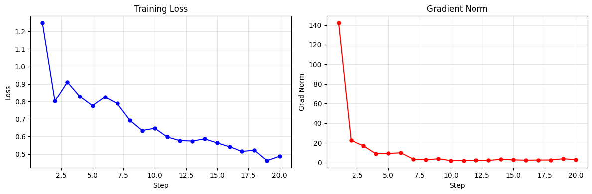

# SFT 指令微调

torchtitan-npu 支持基于对话数据的指令微调（Supervised Fine-Tuning, SFT）。当前已提供 Qwen3 和 DeepSeek-V4 两个模型系列在 NPU 上的 SFT 配置，支持单轮/多轮对话、tool call、自定义编码器、Ulysses Context Parallel 长序列训练。

## 支持矩阵

| 模型 | 任务 / 数据集 | 编码方式 | 单轮 | 多轮 | Tool Call | 配置名 |
|------|-------------|---------|------|------|-----------|--------|
| Qwen3-30B-A3B | GSM8K | Jinja chat template | ✅ | — | — | `sft_qwen3_30ba3b_gsm8k` |
| Qwen3-1.7B | Wordle | Jinja chat template | — | ✅ | — | `sft_qwen3_1_7b_wordle` |
| DeepSeek-V4 | tau-bench | 自定义编码器 (encoding_dsv4.py) | — | ✅ | ✅ | `sft_deepseek_v4_flash_debug_256_experts_43_layers_tau` |
| DeepSeek-V4 | GSM8K | 自定义编码器 (encoding_dsv4.py) | ✅ | — | — | `sft_deepseek_v4_flash_debug_256_experts_43_layers_gsm8k` |

## 架构概述

torchtitan-npu 的 SFT 能力由两层正交配置驱动：

- **chat_encoder**（模型级）：决定消息如何渲染为文本。支持 Jinja chat template（默认）和自定义编码器（通过 `BaseChatEncoder` 子类）。
- **sample_processor**（数据集级）：决定原始数据样本如何转为 OpenAI 格式消息列表。不同数据集写不同的 `process_sample` 函数。

```text
原始样本 → sample_processor → 消息列表 → chat template / chat_encoder → token ids
                                                                      ↓
                                                           label masking
```

### 单轮 vs 多轮

框架统一支持单轮和多轮消息，无需手动指定：

- Qwen3 / ChatML 模板：通过 `<|im_start|>assistant\n` 和 `<|im_end|>` 定位每轮 assistant 回复
- DeepSeek-V4：通过 `DSV4ChatEncoder.encode_messages_with_assistant_ranges()` 返回的分段区间定位 assistant 回复
- 其它无法定位 assistant 区间的模板或编码器会直接报错

---

## 快速开始

### Qwen3-30B-A3B SFT（GSM8K 单轮）

```bash
MODULE=torchtitan_npu.models.qwen3 CONFIG=sft_qwen3_30ba3b_gsm8k bash scripts/run_train.sh
```

### Qwen3-1.7B SFT（Wordle 多轮）

```bash
NGPU=1 MODULE=torchtitan_npu.models.qwen3 CONFIG=sft_qwen3_1_7b_wordle bash scripts/run_train.sh --checkpoint.last_save_in_hf
```

详细数据准备、训练和评测流程见文末 [Wordle SFT 样例](#附录-awordle-sft-样例)。

### DeepSeek-V4 SFT（tau-bench 多轮 + Tool Call）

```bash
MODULE=torchtitan_npu.models.deepseek_v4 CONFIG=sft_deepseek_v4_flash_debug_256_experts_43_layers_tau bash scripts/run_train.sh
```

### DeepSeek-V4 SFT（GSM8K 单轮）

```bash
MODULE=torchtitan_npu.models.deepseek_v4 CONFIG=sft_deepseek_v4_flash_debug_256_experts_43_layers_gsm8k bash scripts/run_train.sh
```

---

## 自定义编码器（ChatEncoder）

当 tokenizer 的 `apply_chat_template()` 不足以表达模型格式或定位监督区间时（如 DeepSeek-V4 的 DSML tool calling、thinking/chat 模式切换、tool 消息合并），需要通过自定义编码器替代 tokenizer 模板路径。

自定义编码器继承 `BaseChatEncoder`。用于训练时，如果模型的分段边界不能由
ChatML header 扫描得到，编码器需要实现 `encode_messages_with_assistant_ranges()`，
一次性返回完整文本、token 序列，以及需要计算 loss 的 assistant token 区间。

不设 `chat_encoder` 时，回退到 tokenizer 的 Jinja2 chat template。当前只支持
ChatML 模板（通过 `<|im_start|>assistant\n` 定位 assistant 区间）；无法定位到
ChatML assistant header 的模板会直接报错，避免静默监督到错误 token。

### DSV4ChatEncoder

DeepSeek-V4 的编码器，薄封装 `encoding_dsv4.py`，并在渲染时按 message 片段
计算 assistant token 区间。这样可以复用 DeepSeek 官方模板逻辑，同时避免把
`<｜Assistant｜>`、`<think>` 等 prompt marker 误纳入监督。

- `thinking_mode`：`"thinking"`（默认，含思考过程）或 `"chat"`（纯对话）
- `drop_thinking`：是否在训练时丢弃思考内容（默认 `True`，节省 token）
- `reasoning_effort`：推理力度，`"max"` / `"high"` / `None`

配置示例：

```python
from torchtitan_npu.patches.encoders import DSV4EncoderConfig

dataloader=ChatDataLoaderConfig(
    ...,
    chat_encoder=DSV4EncoderConfig(
        encoding_module_path="/path/to/encoding_dsv4.py",
        thinking_mode="thinking",    # "chat" | "thinking"
        drop_thinking=True,
        reasoning_effort=None,       # "max" | "high" | None
    ),
)
```

### 为新模型添加编码器

1. 在 `torchtitan_npu/patches/encoders/` 下新建模块（如 `my_model.py`）
2. 继承 `BaseChatEncoder`，实现 `encode_messages_with_assistant_ranges()`
3. 继承 `ChatEncoderConfig`，实现 `build()`
4. 在 `encoders/__init__.py` 中导出
5. 在 `config_registry.py` 的 SFT 配置中通过 `chat_encoder=MyEncoderConfig(...)` 引用

示例：

```python
from torchtitan_npu.patches.encoders import BaseChatEncoder, ChatEncoderConfig

class MyChatEncoder(BaseChatEncoder):
    def encode_messages_with_assistant_ranges(self, messages, tokenizer, eos_id):
        full_text = render_messages(messages)
        full_tokens = tokenizer.encode(full_text, add_bos=True, add_eos=False)
        if full_tokens[-1] != eos_id:
            full_tokens.append(eos_id)

        # 返回需要计算 loss 的 assistant token 区间，范围基于 full_tokens。
        assistant_ranges = locate_assistant_token_ranges(messages, tokenizer)
        return full_text, full_tokens, assistant_ranges

@dataclass(kw_only=True, slots=True)
class MyEncoderConfig(ChatEncoderConfig):
    my_param: str = "default"

    def build(self) -> MyChatEncoder:
        return MyChatEncoder(my_param=self.my_param)
```

---

## 数据预处理

### sample_processor

SFT 的数据预处理在 `config_registry.py` 的配置函数中完成。`process_sample` 接收 HuggingFace 数据集的原始样本，返回 OpenAI 格式消息列表。

#### 单轮示例（Qwen3 + GSM8K）

```python
def process_sample(sample):
    answer = sample["answer"]
    reasoning, final_answer = answer.rsplit("####", 1)
    return [
        {"role": "user", "content": sample["question"]},
        {
            "role": "assistant",
            "reasoning_content": reasoning.strip(),
            "content": final_answer.strip(),
        },
    ]
```

#### 多轮 + Tool Call 示例（DeepSeek-V4 + tau-bench）

```python
def process_tau_sample(sample):
    import json

    raw_messages = sample["messages"]
    messages = json.loads(raw_messages) if isinstance(raw_messages, str) else raw_messages
    messages = [dict(m) for m in messages]

    raw_tools = sample.get("tools", [])
    tools = json.loads(raw_tools) if isinstance(raw_tools, str) else raw_tools

    # 将 tools 注入 system 消息（DSV4 编码器要求）
    if tools:
        if messages and messages[0].get("role") == "system":
            messages[0] = dict(messages[0])
            messages[0]["tools"] = tools
        else:
            messages.insert(0, {"role": "system", "content": "", "tools": tools})

    return messages
```

### 消息格式

`process_sample` 返回 OpenAI 格式消息列表：

```python
# 单轮
[{"role": "user", "content": "..."}, {"role": "assistant", "content": "..."}]

# 带 thinking
[{"role": "user", "content": "..."}, {"role": "assistant", "reasoning_content": "...", "content": "..."}]

# 多轮 + tool call
[
    {"role": "system", "content": "...", "tools": [...]},
    {"role": "user", "content": "..."},
    {"role": "assistant", "content": "...", "tool_calls": [...]},
    {"role": "tool", "content": "...", "tool_call_id": "..."},
    {"role": "assistant", "content": "..."},
]
```

### 框架自动处理

框架拿到消息列表后自动完成：

1. **编码**：通过 Jinja2 chat template 或 `chat_encoder` 渲染为完整 token 序列
2. **Label masking**：通过 ChatML header 扫描或编码器返回的 assistant 区间，仅对 assistant 回复计算 loss
3. **Packing**：对多个样本做 greedy packing（短样本打包到同一 seq_len 窗口，EOS 分隔，per-document position 重置）
4. **截断/丢弃**：超过 seq_len 的样本自动丢弃（而非截断）

---

## Context Parallel

torchtitan-npu 为 Qwen3 和 DeepSeek-V4 提供了自定义 CP 实现。在配置中设置 `context_parallel_degree > 1` 即可启用：

```bash
bash scripts/run_train.sh --parallelism.context_parallel_degree 4
```

关于 Ulysses CP 的实现原理和约束条件，详见[自定义 Context Parallel 特性文档](../feature_guides/parallelism/custom_cp.md)。

## 权重加载与保存

### 加载预训练权重

SFT 配置默认从 HuggingFace 格式加载预训练权重：

```bash
--checkpoint.initial_load_in_hf \
--checkpoint.initial_load_path /path/to/model
```

> **注意**：`checkpoint.folder` 不能与 `checkpoint.initial_load_path` 相同，否则框架会跳过 HuggingFace 权重加载。

### 切换为自己的预训练权重

修改 `checkpoint.initial_load_path` 和 `hf_assets_path` 指向新的权重目录：

```bash
--checkpoint.initial_load_path /path/to/your/model \
--hf_assets_path /path/to/your/model
```

### 保存训练后的权重

训练完成后，权重会自动保存到 `checkpoint.folder` 指定的路径。可通过 `checkpoint.interval` 设置保存间隔：

```bash
--checkpoint.folder /path/to/save \
--checkpoint.interval 100
```

如仅需加载权重而不保存（如调试时），设置 `--checkpoint.load_only`。

## 常见问题

**Q: 数据集跑完一轮就停了？**

默认 `dataloader.infinite=true`，数据集会无限循环。如果设为 false，数据遍历完一轮后训练会停止。tyro 的 bool 参数通过 flag 设置，显式开启或关闭可使用：

```bash
--dataloader.infinite
--dataloader.no-infinite
```

**Q: 超长样本被丢弃了？**

`ChatDataset` 会自动丢弃 token 数超过 `seq_len` 的样本（而非截断），日志中会打印 `Dropping sample` 提示。可增大 `seq_len` 或开启 Ulysses CP 来容纳更长样本。

## 附录 A：Wordle SFT 样例

基于 torchtitan_npu，在 Ascend NPU 上对 Qwen3-1.7B 进行 Wordle 猜词游戏的 SFT 微调。参考 prime-rl 的 [Wordle 示例](https://github.com/PrimeIntellect-ai/prime-rl/blob/main/examples/wordle/README.md)。

### 环境准备

安装评测工具：

```bash
pip install prime                                          # verifiers 框架（含 vf-eval CLI）
git clone https://github.com/PrimeIntellect-ai/prime-rl.git
cd prime-rl
sed -i 's|git@github.com:|https://github.com/|g' .gitmodules
git submodule sync
git submodule update --init deps/verifiers
pip install deps/verifiers/environments/wordle              # wordle 游戏环境
```

### 模型与数据

| 资源 | 链接 | 说明 |
|------|------|------|
| Qwen3-1.7B (instruct) | [HF](https://huggingface.co/Qwen/Qwen3-1.7B) | 含 chat template 的 instruct 版本，~3.8GB |
| willcb/V3-wordle | [HF](https://huggingface.co/datasets/willcb/V3-wordle) | Wordle 游戏多轮对话轨迹 |

### 下载模型权重

```bash
# modelscope
pip install modelscope
python3 -c "
from modelscope import snapshot_download
snapshot_download('Qwen/Qwen3-1.7B', local_dir='./assets/hf/Qwen3-1.7B')
"

# HuggingFace
pip install huggingface_hub
HF_ENDPOINT=https://hf-mirror.com huggingface-cli download Qwen/Qwen3-1.7B --local-dir ./assets/hf/Qwen3-1.7B
```

### 数据集

每个样本包含 `prompt` 和 `completion` 两个字段。训练时通过 HF 在线加载，首次下载后自动缓存。

若网络不通，可在有网的机器上下载原始文件，拷贝到训练环境后转为 parquet：

```bash
# 1. 在有网的机器上下载
hf download willcb/V3-wordle --repo-type=dataset --local-dir ./assets/data/wordle_raw

# 2. 拷贝到训练机器，转为 parquet
python3 -c "
from datasets import load_dataset
ds = load_dataset('./assets/data/wordle_raw', split='train')
ds.to_parquet('./assets/data/wordle/train.parquet')
"
```

查看数据集格式（从本地读取）：

```bash
python3 -c "
from datasets import load_dataset
import pprint
ds = load_dataset('./assets/data/wordle', split='train')
pprint.pprint(next(iter(ds)), width=100, depth=3)
"
```

`torchtitan_npu.models.qwen3.config_registry` 的 `_process_wordle_sample` 函数将 `prompt` 和 `completion` 拼接为完整的 `[system, user, assistant, user, assistant, ...]` 消息列表。

### 模型选择

使用 `Qwen/Qwen3-1.7B`（instruct 版本，已内置多轮对话模板）。

### 可用的 SFT 配置

| 配置名 | 说明 |
|--------|------|
| `sft_qwen3_1_7b_wordle` | 20 步 Wordle SFT 训练 |

### 多轮对话支持

上游 torchtitan 的 `ChatDataset`（[源码](https://github.com/pytorch/torchtitan/blob/ac13e536/torchtitan/hf_datasets/text_datasets.py#L302-L315)）硬编码了 `len(messages) != 2`（仅接受 `[user, assistant]` 单轮格式）。Wordle 的 `willcb/V3-wordle` 数据集每条样本包含 6-10 条消息（多轮游戏轨迹），直接报错。

同时，还需要对对话的 assistant 部分进行 mask，效果等价于 prime-rl 的 `role_to_mask: msg["role"] != "assistant"`——仅对 assistant 消息计算 loss，user（环境反馈）不参与训练。

本 recipe 通过统一的 `torchtitan_npu/patches/torchtitan/chat_dataset.py` 解决以上问题（`torchtitan_npu/__init__.py` 自动加载，无需手动配置）。该 patch 同时服务 Qwen3 多轮 SFT 和 DeepSeek-V4 tool-call SFT，模型格式差异由 Jinja chat template 或 `chat_encoder` 处理。

### 运行训练任务

在线环境：

```bash
export HF_ENDPOINT=https://hf-mirror.com  # 国内需要镜像
NGPU=1 MODULE=torchtitan_npu.models.qwen3 \
  CONFIG=sft_qwen3_1_7b_wordle \
  bash scripts/run_train.sh --checkpoint.last_save_in_hf
```

离线环境（已将数据集下载到本地）：

```bash
NGPU=1 MODULE=torchtitan_npu.models.qwen3 \
  CONFIG=sft_qwen3_1_7b_wordle \
  bash scripts/run_train.sh --checkpoint.last_save_in_hf \
  --dataloader.dataset_path ./assets/data/wordle
```

> `--checkpoint.last_save_in_hf` 在最后一步自动导出 HF 格式。

### 训练结果参考



<details>
<summary>详细日志</summary>

```
step  1: loss 1.25  grad_norm 142.2
step  5: loss 0.57  grad_norm   4.0
step 10: loss 0.53  grad_norm   3.7
step 15: loss 0.50  grad_norm   2.9
step 20: loss 0.49  grad_norm   3.0

local_batch_size=2, global_batch_size=64 (gradient accumulation ×32)
吞吐: 5,619 tokens/s, MFU 16.5%, 显存 33.5GB (55%)
```

</details>

训练完成后，将 tokenizer 文件复制到 checkpoint 目录，推理时直接加载：

```bash
cp assets/hf/Qwen3-1.7B/{config.json,tokenizer.json,tokenizer_config.json,vocab.json,merges.txt} \
  outputs/checkpoint_wordle_sft/step-20/
```

### vf-eval 评测环境

[vf-eval](https://github.com/PrimeIntellect-ai/prime-rl) 是 [prime-rl](https://github.com/PrimeIntellect-ai/prime-rl) 提供的命令行评测工具，加载 Wordle 环境，向推理服务器发送多轮对话请求，模拟完整游戏过程并计算 reward。参考: [prime-rl Wordle 示例](https://github.com/PrimeIntellect-ai/prime-rl/blob/main/examples/wordle/README.md)

Wordle 环境依赖 nltk 语料库，首次使用需下载：

```bash
python3 -c "
import nltk
nltk.download('words')
nltk.download('averaged_perceptron_tagger')
"
```

### 启动推理服务器

`scripts/infer_server.py` 是一个极简的 OpenAI 兼容推理服务器，用 `transformers` + `torch_npu` 直接加载 SFT 权重，监听 8000 端口。

**它做了什么：**

1. 加载 tokenizer + 模型（bf16，`.to("npu:0")`）
2. 收到 `POST /v1/chat/completions` 请求时：
   - 提取 `messages`（`[{role, content}, ...]`）
   - 调用 `tokenizer.apply_chat_template(messages)` 将消息列表转为 Qwen3 格式的 prompt 字符串
   - 例如 `[{"role":"user","content":"Guess a word"}]` 转为：`<|im_start|>user\nGuess a word<|im_end|><|im_start|>assistant\n`
   - tokenize → NPU 推理 → decode → 返回 `{"choices": [{"message": {"content": "..."}}]}`

**启动服务器：**

```bash
# 安装 transformers 依赖
pip install transformers
python3 scripts/infer_server.py \
  --model ./outputs/checkpoint_wordle_sft/step-20 \
  --port 8000 &

# 验证
curl http://localhost:8000/health
# → {"status": "ok"}
```

### 运行 vf-eval

`vf-eval` 是 [prime-rl](https://github.com/PrimeIntellect-ai/prime-rl) 的命令行评测工具。它加载 Wordle 游戏环境（`deps/verifiers/environments/wordle/`），向推理服务器发送多轮对话请求，自动计算 reward。

**工作流程**：

1. 从 20 个预留评估词中选一个秘密词（不在训练集中）
2. 发送系统提示 + 游戏规则 → 推理服务器
3. 模型返回 `<think>...</think><guess>[word]</guess>`
4. 环境解析 `<guess>` 中的词，计算 G/Y/X 反馈
5. 反馈发回模型 → 重复步骤 3-5（最多 6 轮）
6. 游戏结束，计算 reward（correct + format + partial + length）

```bash
vf-eval wordle \
  --provider openai \
  --model instruct-sft \
  --api-base-url http://localhost:8000/v1 \
  --num-examples 20 \
  --rollouts-per-example 3 \
  --max-concurrent 1 \
  --max-tokens 1024 \
  --temperature 0.6
```

| 参数 | 说明 |
|------|------|
| `--provider openai` | 使用 OpenAI 兼容 API（`/v1/chat/completions`） |
| `--api-base-url` | 推理服务器地址 |
| `--num-examples 20` | 评测 20 局（每局不同秘密词） |
| `--rollouts-per-example 3` | 每局重复 3 次，取平均 |
| `--max-concurrent 1` | 串行请求（单线程服务器避免过载） |
| `--max-tokens 1024` | 每轮最多生成 1024 tokens |
| `--temperature 0.6` | 采样温度（>0 产生多样性） |

### 评测指标说明

Wordle 环境每局最多 6 轮猜测，每轮模型输出 `<guess>[word]</guess>`，环境返回 G/Y/X 反馈。Reward 由 verifiers 子模块中的 [`wordle.py`](https://github.com/PrimeIntellect-ai/verifiers/blob/main/environments/wordle/wordle.py) 定义：

| 指标 | 实现 | 计算方式 | 满分含义 |
|------|------|---------|---------|
| `correct_answer` | [`L23-27`](https://github.com/PrimeIntellect-ai/verifiers/blob/main/environments/wordle/wordle.py#L23-L27) | `guess == "[" + answer + "]"` | 猜对秘密词 = 1.0 |
| `partial_answer` | [`L39-53`](https://github.com/PrimeIntellect-ai/verifiers/blob/main/environments/wordle/wordle.py#L39-L53) | `0.2 * num_greens + 0.1 * num_yellows` | 部分字母正确 |
| `length_bonus` | [`L29-37`](https://github.com/PrimeIntellect-ai/verifiers/blob/main/environments/wordle/wordle.py#L29-L37) | `correct / num_guesses` | 更少步数猜中奖励更高 |
| `format_reward` | `parser.get_format_reward_func()` | XML 解析器校验 `<guess>...</guess>` | 格式合规 = 1.0 |

### 评测结果对比

#### 基础模型（Qwen3-1.7B）

| 指标 | 值 | 解读 |
|------|-----|------|
| format_reward | **0.200** | 未经过 SFT，几乎无法遵循 `<guess>...</guess>` 格式 |
| avg reward | **0.04** | 仅来自极少量 format，没有有效的猜词行为 |
| correct_answer | 0% | 基础模型不会玩 Wordle |
| partial_answer | 0% | 无有效字母匹配 |
| num_turns | 2.0 | 2 轮后即放弃（生成质量差，被环境判定无效） |
| 每轮生成时间 | 25-58s | 输出冗长的 rambling text，推理极慢 |

#### SFT 微调后

| 指标 | 值 | 解读 |
|------|-----|------|
| format_reward | **1.000** | 模型 100% 遵循 `<guess>[word]</guess>` 格式 — SFT 目标达成 |
| avg reward | **0.40** | 主要来自 format (1.0×0.2) + partial (字母部分正确) |
| correct_answer | 0% | 20 步 SFT 不足以学会策略性猜词 — 需要 RL 阶段 |
| partial_answer | 0.20 | ~1 个字母 G/Y 正确，模型在试探但未收敛到正确策略 |
| num_turns | 7.0 | 完整玩满 7 轮，稳定多轮对话 |
| 每轮生成时间 | ~2s | 输出简洁，推理效率高 |

> **总结**：仅 20 步 SFT（gradient accumulation ×32, effective batch_size=64）即让 Qwen3-1.7B 从完全不会玩 Wordle 变为 100% 遵循游戏格式、稳定完成多轮对话。策略性猜词能力（correct_answer）仍需 RL 阶段训练。

### Pass@k 说明

vf-eval 通过 `--rollouts-per-example` 控制每个评估词的独立尝试次数：

| 指标 | 含义 | 本 recipe 配置 |
|------|------|---------------|
| `pass@1` | 单次尝试正确率 — 反映模型的直接能力 | 报告 3 次 rollouts 的均值与标准差 |
| `pass@k` | k 次独立尝试中至少一次正确的概率 — k 越大越能容忍随机性 | `--rollouts-per-example 3` |
| `pass^k` | k 次尝试全部正确的概率 — 衡量一致性和稳定性 | 与 pass@k 对比，判断采样是否稳定 |

| 场景 | 解读 |
|------|------|
| pass@3 ≫ pass@1 | 模型有潜力但采样不稳定，多次尝试能发现正确答案 |
| pass^k ≈ pass@k | 模型输出一致性高，每次尝试结果相近 |
| format_reward = 1.0 | SFT 目标达成 — 模型 100% 遵循 Wordle 对话格式 |
| correct_answer = 0% | 策略性猜词需要 RL 阶段训练 |
