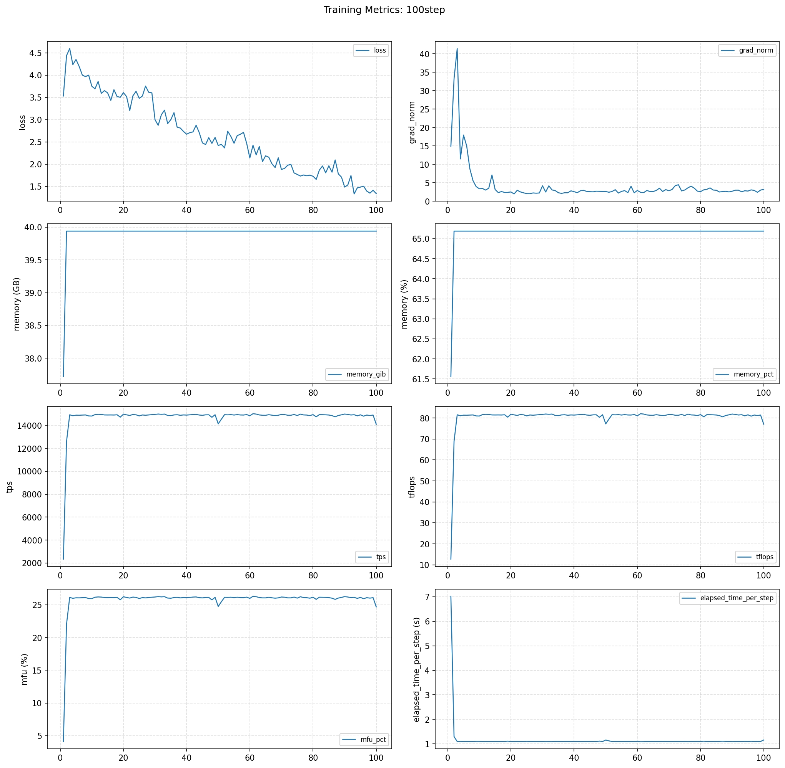

# Qwen3-0.6B 单机样例（云开发平台）

本文档给出 `torchtitan_npu/models/qwen3` 在云开发平台上的最小可运行样例，默认使用 `qwen3_0.6b.toml` 进行单机场景训练。

## 1. 环境准备

选择云平台中的 `cann_9.0.0-beta.2-py3.11-A3-arm-20260422` 镜像创建环境即可。

> 说明：镜像名称中的日期后缀（如 `20260422`）会随云平台版本迭代更新，选择时请确认满足以下两个关键条件即可：
> - **Python 版本**：`py3.11`
> - **架构**：`A3-arm`

### 1.1 卸载与安装指定版本（需管理员权限）

执行前需要先卸载云平台自带的 `torch` 和 `torch_npu`，卸载需要管理员权限。

卸载（管理员权限）：`sudo pip uninstall -y torch torch_npu`

进入仓库根目录后安装依赖：
```bash
pip install -r requirements.txt
```

## 2. 准备 Ascend 环境变量

本样例基于云平台环境：云平台默认是 **2 die**，需要按云平台场景调整 `scripts/run_train.sh` 里的 CANN 包路径：

- **CANN 包路径更新**：当前云环境中 CANN 包路径为 `/home/developer/Ascend/ascend-toolkit/set_env.sh`，需将脚本中对应的 `source` 行修改为该路径。
- **关闭 nnal 包**：当前样例不依赖 `nnal` 包，请将脚本中的 `source /usr/local/Ascend/nnal/atb/set_env.sh` 注释掉，避免因路径不存在导致启动失败。

> 关于卡数（`NGPU`）与训练配置（`CONFIG_FILE`），无需修改脚本，可以在拉起命令中通过环境变量直接覆盖，详见第 4 节。

## 3. 模型权重准备

本样例使用的Qwen3-0.6B模型权重准备方法如下：
```bash
# 从魔塔社区下载模型的基础文件，存放在当前目录的 ./Qwen3-0.6B 目录下
mkdir ./Qwen3-0.6B
modelscope download --model Qwen/Qwen3-0.6B --local_dir ./Qwen3-0.6B
```
如果目录改动需要同步修改 `qwen3_0.6b.toml` 中 `model.hf_assets_path` 和 `checkpoint.initial_load_path`。

## 4. 使用默认配置启动（qwen3_0.6b）

`scripts/run_train.sh` 支持通过环境变量覆盖默认参数，云平台 2 die 场景下可在拉起命令中直接指定 `NGPU` 与 `CONFIG_FILE`，无需修改脚本：

```bash
NGPU=2 CONFIG_FILE=./torchtitan_npu/models/qwen3/train_configs/qwen3_0.6b.toml bash scripts/run_train.sh
```

环境变量说明：
- `NGPU=2`：覆盖脚本中 `NGPU=${NGPU:-"8"}` 的默认值，匹配云平台 2 die 场景。
- `CONFIG_FILE=...`：指定本样例的 Qwen3-0.6B 训练配置，覆盖脚本中默认的 DeepSeek 配置。

其余默认值（无需指定）：
- 默认训练入口：`torchtitan_npu.entry`。
- 默认数据集：`./tests/assets/c4_test`（在所选 toml 中配置）。
- 默认输出目录：`./outputs`（在所选 toml 中配置）。


## 5. 常见问题

- `source .../set_env.sh` 失败：检查 Ascend Toolkit 安装路径并修正脚本或手动 `source`。
- 启动后找不到数据集：确认 `qwen3_0.6b.toml` 中 `training.dataset_path` 路径可访问。
- 卡数不符：确认 `NGPU` 与云开发平台分配的 NPU 资源一致。
- **关于 `./outputs/checkpoint` 目录**：训练默认会从该目录加载已有 checkpoint 续训，因此请按场景选择是否清理：
  - **从头开始训练**（如调参、复现 loss 曲线、对比实验）：删除 `./outputs/checkpoint` 整个目录，否则会从上一次保存的步数继续，导致起始 step 不为 0。
  - **续训 / 断点恢复**（如训练中途异常退出、需要在原训练基础上继续）：保留该目录，重新拉起后会自动从最近一次 checkpoint 恢复。

## 6. 训练效果图

